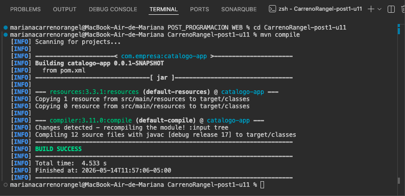
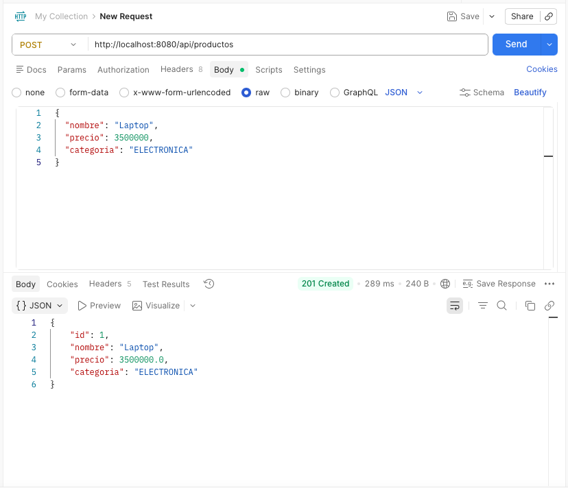
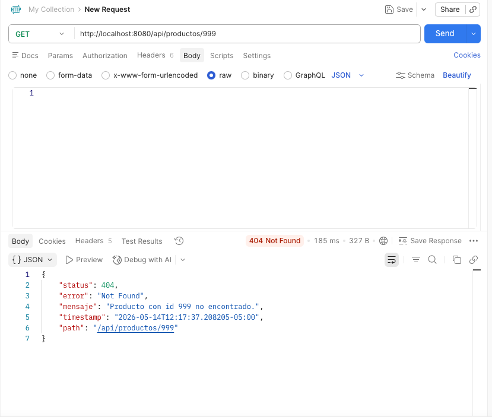
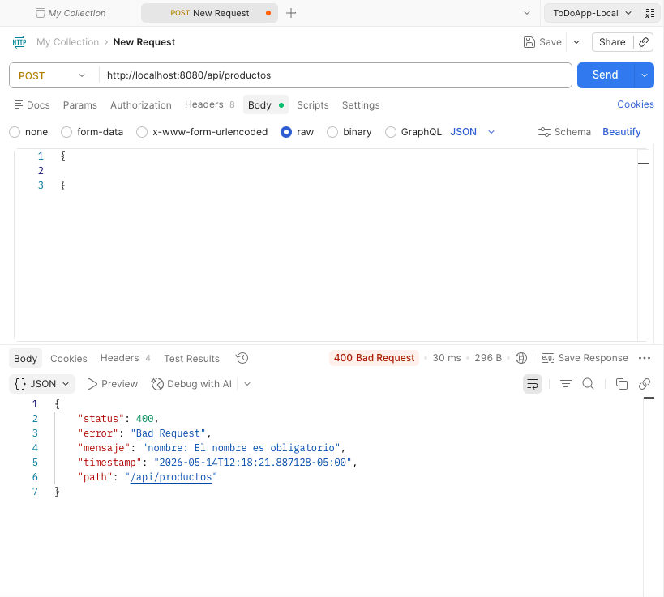

# CarrenoRangel-post1-u11


Refactorización de una aplicación Spring Boot aplicando principios SOLID (SRP y DIP),
patrones DAO/DTO, Factory y manejo centralizado de excepciones con `@RestControllerAdvice`.

---

## Ejecutar

```bash
mvn spring-boot:run
```

La aplicación queda disponible en `http://localhost:8080`

---

## Arquitectura
Controller → Service (interfaz, DIP) → ServiceImpl (SRP) → Repository (DAO) → Entity
↑
ProductoFactory
(convierte DTO ↔ Entity)
DTOs:
ProductoRequestDTO  → entrada con validaciones (@NotBlank, @Positive)
ProductoResponseDTO → salida sin campos internos
Errores:
GlobalExceptionHandler (@RestControllerAdvice)
├── RecursoNoEncontradoException → 404
├── MethodArgumentNotValidException → 400
└── Exception genérica → 500

---

## Estructura de Paquetes
src/main/java/com/empresa/catalogo/
├── controller/
├── service/
├── repository/
├── dto/
├── entity/
├── factory/
└── exception/

---

## Evidencias

**Evidencia 1 — Compilación exitosa**


**Evidencia 2 — POST exitoso (201 Created)**


**Evidencia 3a — GET id inexistente (404 Not Found)**


**Evidencia 3b — POST body vacío (400 Bad Request)**

